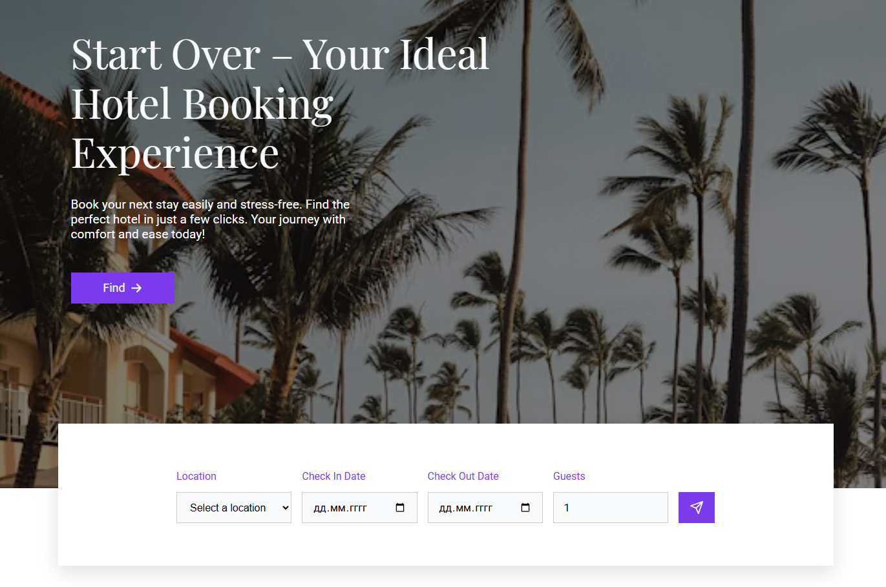

[](https://react.dev/)
[](https://sass-lang.com/)

**🌍 Live
Demo: [booking-app-hotels.vercel.app](https://booking-app-hotels.vercel.app/)**

# Start Over – Hotel Booking Website

---

**Start Over** - a web application for quick and convenient hotel reservations.
A simple interface, adaptive design and smooth animation make the service
accessible to every user.

## ⚙️ Technologies and stack

---

- **React** – for building a component interface
- **SCSS** – for flexible styling
- **Zustand** – state management
- **Zod** and **React Hook Form** – form validation
- **Framer Motion** – animations
- **Swiper** – interactive carousels
- **React Toastify** - notifications
- **React Router DOM** – routing
- **Axios** – backend requests

## ✨ Features

---

- **Hotel search and filtering**
- **Informative blog section**
- **Forms with validation and notifications**
- **Responsive design**
- **Carousels and interactive elements**
- **Clean and stylish interface**

## 📂 Project structure

---

```text
📂 booking-app
├── 📂 public               # static files
├── 📂 src
│   ├── 📂 assets           # images
│   ├── 📂 api              # backend requests
│   ├── 📂 components       # components
│   ├── 📂 features         # form validation
│   ├── 📂 pages            # pages
│   ├── 📂 routes           # application routes
│   ├── 📂 store            # state management (Zustand)
│   ├── 📂 styles           # global styles
│   ├── 📄 App.js
│   └── 📄 index.js
├── 📄 .editorconfig
├── 📄 .eslintrc.js
├── 📄 .prettierrc
├── 📄 package.json
├── 📄 package-lock.json
└── 📄 README.md
```

## 🚀 Local project launch

---

**Clone the repository**

`https://github.com/viiktory/booking-app.git`

**Install dependencies**

`npm install`

**Run the project**

`npm start`

Now, head to **http://localhost:3000** in your browser
